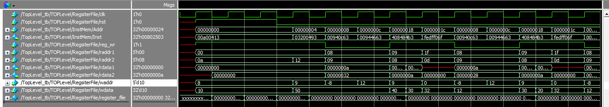

# RISCV-32I-Single-Cycle-Processor
Implementation of RISCV32I Single Cycle Architecture consisting of six base instructions (R, I, B, S, J, U).
#Reference
Some part of this material and understanding is taken from book " Digital Design and Computer Architecture RISC-V Edition " by Sarah L Harris and David M Harris.
